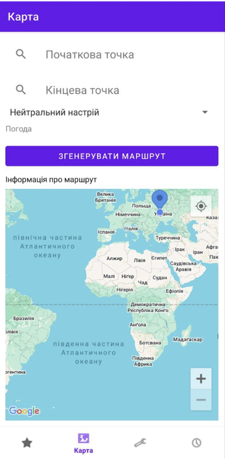
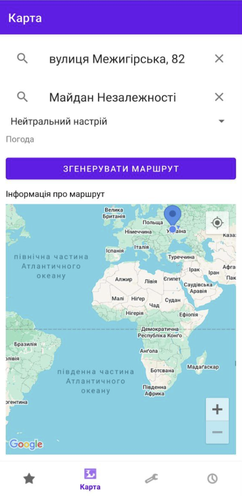
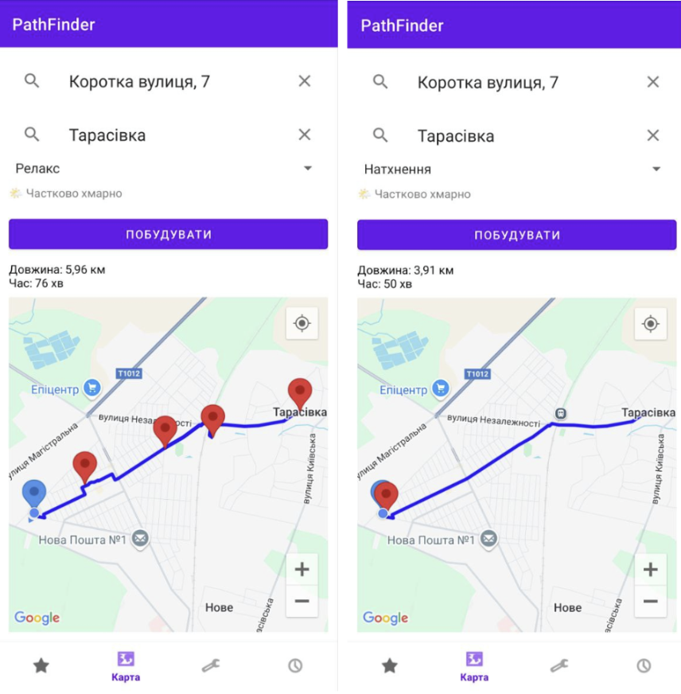
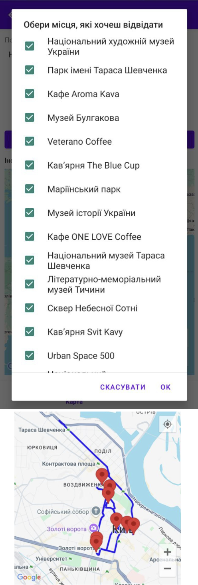
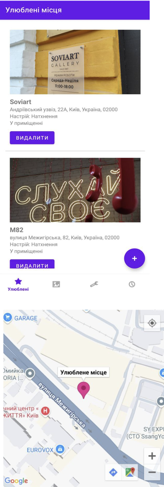
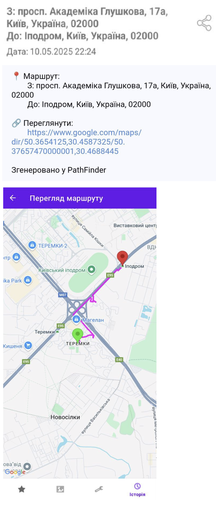

# 🗺️ PathFinder – Dynamic Mood & Weather Routing App

> A native Android navigation application that dynamically adapts walking routes based on real-time weather conditions and user mood. Developed as a 3rd-year Coursework Project at Taras Shevchenko National University of Kyiv.

*(Note: This repository serves as a visual showcase. The source code is not included to protect academic integrity).*

---

## 📥 Download & Install
You can download the compiled Android application directly from this repository:
- [Download PathFinder APK](./Pathfinder.apk)

---

## 🚀 Key Features
- **Mood-Based Navigation:** Generates personalized routes and suggests relevant places based on the user's current emotional state (e.g., Relax, Inspiration).
- **Dynamic Weather Adaptation:** Integrates with the Open-Meteo API to alter routes in real-time (e.g., suggesting indoor places like museums or cafes during rain).
- **Smart Route Building:** Interactive map interface powered by Google Maps API for precise pedestrian routing and ETA calculations.
- **Local-First Storage:** Favorites and route history are saved locally using GSON and internal storage for fast, offline access.
- **Clean Architecture:** Built following the MVVM pattern for robust data handling and UI separation.

---

## 🛠️ Tech Stack
- **Language:** Kotlin
- **Architecture:** MVVM (Model-View-ViewModel)
- **APIs:** Google Maps SDK, Google Places API, Open-Meteo API
- **Networking & Data:** Retrofit, GSON
- **Local Storage:** Internal JSON Storage

---

## 📸 App Showcase

### 1. Main Map & 2. Route Generation

  
  

### 3. Mood-Based Routing & 4. Weather Alerts
> The app dynamically alters suggested stops based on the selected mood, and provides safe indoor alternatives during bad weather.

  
  

### 5. Indoor Suggestions & 6. Favorite Places

  
  

### 7. Route History

  

